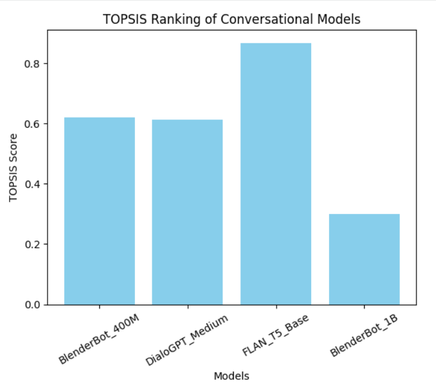

# Text Conversation TOPSIS

## Description
The TOPSIS (Technique for Order Preference by Similarity to Ideal Solution) approach is used in this project to compare pre-trained conversational AI models. Multiple performance metrics, including response quality, speed, model size, latency, and usability, are used to assess the models. Python is used for the analysis, and all of the selected models are pre-trained text conversational models from HuggingFace.

## Objectives
- To evaluate multiple conversational AI models using a multi-criteria decision-making approach
- To apply the TOPSIS method for ranking models
- To identify the best conversational model based on practical and performance-based parameters

## Methodology
1. Conversational AI model selection
2. Determining the evaluation criteria (parameters)
3. Assigning weights to each criterion
4. Constructing the decision matrix
5. Normalizing the matrix
6. Computing the weighted normalized matrix
7. Identifying the ideal best and worst solutions
8. Computing TOPSIS scores
9. Ranking models according to TOPSIS scores
10. Visualizing results through graphs

## Pre-trained Models Used
The following pre-trained conversational models were evaluated:
- **BlenderBot 400M**
- **DialoGPT Medium**
- **FLAN-T5 Base**
- **BlenderBot 1B**

All models are publicly available on HuggingFace and are widely used for conversational AI tasks.

## Input Sample Data

| Model Name | Response Quality | Speed | Model Size (MB) | Latency (ms) | Ease of Use |
|------------|------------------|-------|-----------------|--------------|-------------|
| BlenderBot 400M | 7 | 8 | 400 | 300 | 8 |
| DialoGPT Medium | 6 | 7 | 350 | 250 | 9 |
| FLAN-T5 Base | 8 | 9 | 250 | 180 | 8 |
| BlenderBot 1B | 9 | 6 | 1000 | 450 | 6 |

## Results
After applying the TOPSIS algorithm, each model was assigned a TOPSIS score and ranked accordingly.

| Model Name | Response Quality | Speed | Model Size (MB) | Latency (ms) | Ease of Use | TOPSIS Score | Rank |
|------------|------------------|-------|-----------------|--------------|-------------|--------------|------|
| BlenderBot 400M | 7 | 8 | 400 | 300 | 8 | 0.619588 | 2 |
| DialoGPT Medium | 6 | 7 | 350 | 250 | 9 | 0.612301 | 3 |
| FLAN-T5 Base | 8 | 9 | 250 | 180 | 8 | 0.866729 | 1 |
| BlenderBot 1B | 9 | 6 | 1000 | 450 | 6 | 0.299156 | 4 |

The findings show that **FLAN-T5 Base** achieved the highest TOPSIS score among all evaluated models. This demonstrates that FLAN-T5 Base offers the best overall balance in terms of response quality, speed, low latency, moderate model size, and usability.

## Comparison of All Models Based on TOPSIS Score
The graph below shows the TOPSIS score of each conversational model and helps in visually identifying the best-performing model.

## Comparison of All Models Based on Parameters
The graph below compares the input parameters of all models, providing insight into how each model performs across different evaluation criteria.

## Conclusion
Based on the TOPSIS evaluation, **FLAN-T5 Base** emerged as the most suitable conversational AI model among the selected alternatives. It provides a balanced trade-off between response quality, speed, low latency, manageable model size, and ease of use. The use of TOPSIS ensured a systematic and unbiased evaluation by considering both beneficial and non-beneficial criteria.

---

## Technologies Used
- Python
- HuggingFace Transformers
- TOPSIS Algorithm
- Data Visualization Libraries

## How to Use
1. Clone this repository
2. Install required dependencies
3. Run the TOPSIS analysis script
4. View the results and visualizations

## References
- HuggingFace Model Hub
- TOPSIS Methodology Documentation
